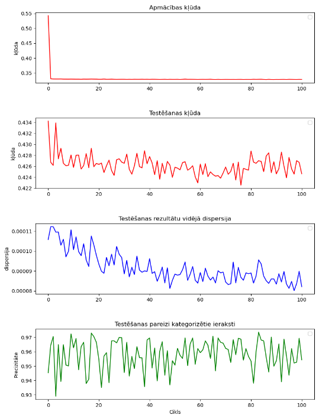

Repository contains the implementation of three BNN algorithms for the mushroom dataset - Bayes by backprop (BBB), Monte Carlo Dropout (MC-D), Variation Inference (VI).

# Things to check:
1. Pašlaik BBB un MC-D implementācijas sasniedz tikai 70-80% accuracy - esmu mēģinot dažādus hiperparametru vērtīas, nespēju uzlabot algoritmus.

Novērotie rezultāti līdz šim:

### BBB:

### MC-D:

2. Vai bayes inference implementēts pareizi?